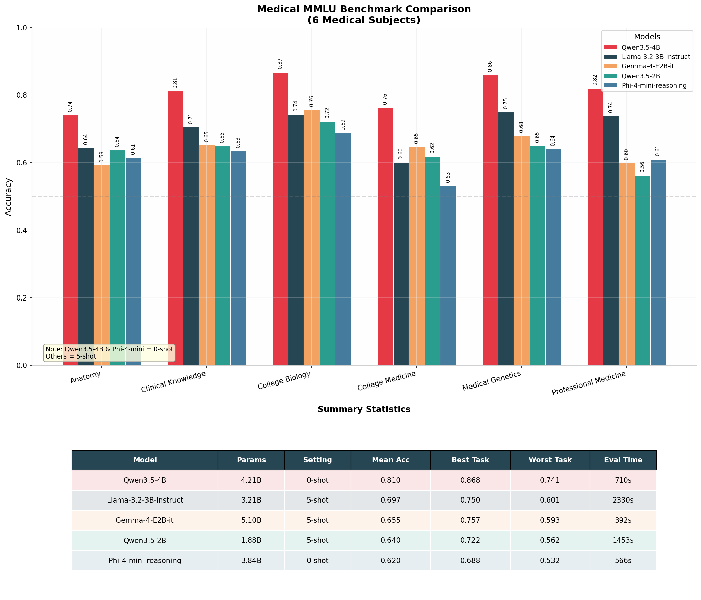

# MEDLLM — Offline Medical Support for African Laptops

**Domain:** Healthcare & Medical 
**Current best checkpoint:** MEDLLM V1 SFT 2.0 (`Laptopllm/MEDLLM_V1_SFT_2.0` → `MEDLLM_V1_SFT_2.0-Q4_K_M.gguf` ~2.7 GB) — one triage repair pending 
**Base model:** [Qwen3.5-4B-Base](https://huggingface.co/Qwen/Qwen3.5-4B-Base) — Apache 2.0, 4.21B params, ctx 262144 
**Runtime:** `llama.cpp` · GGUF `Q4_K_M` · `model/MEDLLM_V1_SFT_2.0-Q4_K_M.gguf` 
**Report status:** 21 August 2026. All scores are development runs; not clinical certification.

---

## 1. Problem

Many people and health workers in Africa cannot depend on a cloud medical assistant. Internet access can be slow or expensive, patient information is sensitive, and monthly API fees add up. MEDLLM is our attempt to put useful **medical question answering for everyone** patients and clinicians alike on an ordinary laptop, covering patient education, medication guidance, and basic triage support offline.

**Target users (African context, English scope `en`):**

| User group | Need MEDLLM fills | Example use |
|---|---|---|
| **(a) Non-medical end-users: the general public** | Plain-language answers to everyday medical questions without internet or clinic visit; trustworthy patient education in simple English | *"What causes malaria vomiting in children? When should I go to hospital?"* — direct reply, action first, no jargon |
| **(b) Community health extension workers / frontline nurses** | Fast decision support where lab/imaging is unavailable: differential hints, Red/Yellow/Green/Black urgency triage, referral rationales | Mass-casualty or rural clinic intake — who needs immediate referral vs routine care |
| **(c) Nursing and medical students** | Exam-style knowledge and Nigerian clinical context for learning (NigeriaMedQA / MedQA / AfriMedQA) | Licensing revision and case-based study offline |

Together these groups define MEDLLM as an **education and frontline triage** tool that teaches and supports, with referral decisions still made by a person. Language scope is `en`; the base model's 201-language coverage is reserved for future work and not claimed for medical accuracy today.

Our target is the [ADTC standard laptop](https://adtc-2026.devpost.com/): 8 GB RAM, integrated graphics, a mid-range x86 CPU, and no internet during use. The profiler enforces 100% offline inference and OOM disqualification at 8 GB. MEDLLM is an information tool. It is not a doctor and it is not a replacement for emergency services or clinical judgement.

## 2. Why we selected Qwen3.5 4B

We chose the 4B base model for five practical reasons:

1. **It fits the laptop target.** Its `Q4_K_M` GGUF is about 2.7 GB, leaving memory for the KV cache, runtime, and operating system within the strict 7 GB peak-RAM budget.
2. **It gives more quality headroom than a 2B model.** Medical questions need factual recall, careful reading, and instruction following. A 4B model is still small enough for CPU use but gives us more room to train these behaviours.
3. **It is designed for further training.** We used the base checkpoint, not the chat model, so we could first teach it medical language and then teach it how to answer.
4. **It has broad language coverage.** The official model card reports support for 201 languages and dialects. This is useful for future African-language work, although we do not claim strong local-language medical performance yet.
5. **It is practical to release.** It uses the Apache 2.0 licence and works with the required GGUF and `llama.cpp` toolchain.

### 2.1 Comparisons before training — why Qwen 3.5 4B won

Before any training we ran a matched Medical MMLU comparison on six medical subjects (Anatomy, Clinical Knowledge, College Biology, College Medicine, Medical Genetics, Professional Medicine). Every model saw the same `lm-eval` harness version.

| Model | Params | Setting | Mean acc | Best task | Worst task |
|---|---:|---|---|---:|---:|
| **Qwen3.5-4B** | 4.21B | 0-shot | **0.810** | 0.868 College Biology | 0.741 Anatomy |
| Llama-3.2-3B-Instruct | 3.21B | 5-shot | 0.697 | 0.750 Med Genetics | 0.601 College Medicine |
| Gemma-4-E2B-it | 5.10B | 5-shot | 0.655 | 0.757 College Bio | 0.593 Anatomy |
| Qwen3.5-2B | 1.88B | 5-shot | 0.640 | 0.722 College Bio | 0.562 Prof Medicine |
| Phi-4-mini-reasoning | 3.84B | 0-shot | 0.620 | 0.688 College Bio | 0.532 College Medicine |

> Note in figure: Qwen3.5-4B & Phi-4-mini were 0-shot; others were 5-shot. Despite the handicap, Qwen3.5-4B led every subject (e.g., Anatomy 0.74 vs 0.64 next best, Clinical Knowledge 0.81 vs 0.71, Professional Medicine 0.82 vs 0.74). This, plus trainability of the base checkpoint and Apache 2.0/GGUF support, made 4B the balanced choice over raw speed of smaller models.

### 2.2 Alternatives we evaluated

| Model | Size | Licence / access | Strength seen | Why not chosen |
|---|---:|---|---|---|
| Qwen3.5-2B | 1.88B | Apache 2.0, GGUF-ready | Fastest, smallest RAM | Mean 0.640 — too much medical knowledge lost for 4B→2B saving |
| Llama-3.2-3B-Instruct | 3.21B | Llama licence | 5-shot 0.697, reasonable | Instruct-tuned, less flexible for CPT from base; behind Qwen4B 0-shot on every task |
| Gemma-4-E2B-it | 5.10B | Gemma licence | 5-shot 0.655 | Larger yet weaker than Qwen4B 0-shot; 5.1B hurts RAM/speed |
| Phi-4-mini-reasoning | 3.84B | MS licence, promising triage | Strong thinking traces; current 54% triage on **50/87** only | Incomplete comparison (50 vs 87 scored for others); kept as *teacher* candidate for final repair, not final checkpoint |
| MedGemma 4B | ~4B | Health-specific | Medical pre-training | Less public CPT/SFT flexibility at this scale; Qwen base was more proven for `llama.cpp` |

Phi-4-mini remains under check as a possible teacher for the pending triage repair; its 54% covers only 50 questions so it is not a like-for-like comparison with the 87-question MEDLLM scores above.

## 3. Why we selected `Q4_K_M`

`Q4_K_M` stores most model weights in about four bits. This reduces the model from a large training checkpoint to a laptop-sized file while protecting important weights more carefully than simpler four-bit methods.

We selected it because ADTC gives 50% of the score to answer quality, 30% to speed, and 20% to memory efficiency.

| Quant | Approx. file | Peak RAM headroom on 8 GB | Effect |
|---|---:|---|---|
| Q2_K / Q3_K_M | ~1.6–2.1 GB | Largest | Removes too much medical knowledge |
| **Q4_K_M** | **~2.7 GB** | **Fits 7 GB budget with KV cache + OS** | **Best 50/30/20 balance — chosen** |
| Q5_K_M | ~3.3 GB | Tighter | Slightly better quality, higher OOM / speed risk |
| Q8_0 | ~5.4 GB | Often exceeds budget | Too large for required budget laptop |

A larger Q5 or Q8 may retain slightly more quality, but it leaves less room for the context cache and increases the risk of crossing the RAM limit. A smaller Q2 or Q3 saves memory but can remove too much medical knowledge. The `participant_laptop` profiler below (6.23 tok/s, 2844 MB peak) confirms the choice.

### 3.1 Constraints that shaped model size and training time

Three hard constraints — **target device, quality data, compute, and cost** — jointly fixed our stack at 4B + LoRA + Q4_K_M and capped training duration:

* **Target Device:** ADTC evaluates every submission on a single budget profile: the standard laptop — a mid-range x86 or x64 CPU with 8 GB of RAM, integrated graphics only, and no internet during use. Our measured participant_laptop that produced the numbers in an AMD Ryzen 7 8845H, 6.6 GB RAM, no discrete GPU, Debian 13 tested through the Docker image of the profiler, well within that envelope. With Q4_K_M the model file is ~2.7 GB with 4,205,751,296 params and profiles at peak RSS 2843.98 MB / steady 2732.92 MB, leaving headroom for the KV cache and OS — which is why Q5_K_M (~3.3 GB) and Q8_0 (~5.4 GB) were rejected despite marginally higher quality.

* **Quality data:** African medical text at token scale was scarce. In the final CPT pack (717,032,988 tokens / 587,054 records), African medical was 109.9M (15.3%) and safety/triage only 0.09M (0.01%) — mostly research literature, not first-contact ESI/ETAT guidance. The mix gap later surfaced as weak triage. This forced SFT2 to be a *quality-over-scale* rebuild: 30,000 deduped rows (`27k / 1.5k / 1.5k` with `family_id` split) and strict 22,500 direct / 3,000 brief-rationale / 4,500 clarification style control, rather than scaling the 75k SFT1 mix.
* **Compute to fine-tune:** Training used Modal `L40S` with 4-bit LoRA adapters (CPT `r64 α128 4096 ctx` → SFT `r32`/repair `r16`), which required nursing every step (`VolumeCommitCallback`, bfloat16). Packing was on for CPT (plain text) but off for SFT (to avoid cross-patient context leakage) with assistant-only loss. One CPT epoch is 73,367 steps; most loss gain arrived before step 50,000 (1.8084→1.7804 at step 70,000), so repeating the epoch was compute-inefficient — we selected step 70,000.
* **Cost:** A 7–8B model or full fine-tuning would have multiplied step time, VRAM, and GGUF size (and threatened the 8 GB budget). The 4B base plus short, low-LR schedules — CPT `2e-5` cosine (after a `2e-4` pilot diverged) and pending repair `1e-5` for ~141 steps with 35-step checkpoints — minimized GPU hours while meeting the required offline GGUF quality. Q4_K_M directly reduced both download size and peak RAM, closing the cost loop.

Together these constraints ruled out a larger model or longer schedule and yielded the current SFT 2.0 stack.

## 4. What we trained

We used two different stages:

- **Continued pre-training (CPT):** teach the base model medical language and African medical context from plain text.
- **Supervised fine-tuning (SFT):** teach the model how to answer a user directly, explain briefly, ask for missing information, and follow safety instructions.

### 4.1 Continued pre-training data

The final CPT run used **717,032,988 tokens in 587,054 records**. It contained 501.9 million medical tokens plus general and reasoning replay. Replay was included to reduce the risk that the model would forget useful general skills while learning medicine.

| Data section | Tokens | Share | Main sources |
|---|---:|---:|---|
| Global medical | 391.5M | 54.6% | [PMC Open Access](https://pmc.ncbi.nlm.nih.gov/tools/openftlist/), [Biomed Enriched](https://huggingface.co/datasets/almanach/Biomed-Enriched), [NCBI Bookshelf](https://www.ncbi.nlm.nih.gov/books/) |
| General replay | 143.4M | 20.0% | [FineWeb-Edu](https://huggingface.co/datasets/HuggingFaceFW/fineweb-edu) |
| African medical | 109.9M | 15.3% | Africa-focused PMC articles and selected African guideline text |
| Reasoning replay | 71.7M | 10.0% | [FineMath](https://huggingface.co/datasets/HuggingFaceTB/finemath), [OpenR1 Math](https://huggingface.co/datasets/open-r1/OpenR1-Math-220k), [CodeParrot](https://huggingface.co/datasets/codeparrot/codeparrot-clean) |
| Patient education | 0.47M | 0.06% | [MedlinePlus](https://medlineplus.gov/xml.html) |
| Safety and triage | 0.09M | 0.01% | WHO ETAT/IMCI and ESI material |

The data passed our schema, duplicate, and known-test-overlap checks. No synthetic text was counted in this CPT pack. The mix was not perfect: safety and triage text was far too small, and African medical text was mainly research literature rather than first-contact clinical guidance. This gap later appeared in the triage results.

### 4.2 Continued pre-training setup and result

| Setting | Value |
|---|---|
| Training method | 4-bit adapter training; merged into a 16-bit checkpoint after training |
| Sequence length | 4,096 tokens |
| Adapter | Rank 128, alpha 256 |
| Schedule | One epoch, 73,367 steps, cosine learning-rate schedule |
| Peak learning rate | `2e-5` |
| Hardware | L40s |
| Selected checkpoint | Step 70,000 |

An early pilot used a learning rate of `2e-4` and became worse. We reduced it to `2e-5`; the full run then stayed stable. Validation loss fell from 1.8084 at step 2,000 to 1.7804 at step 70,000. Patient-education loss improved by 9.45%, African-medical loss by 2.40%, and global-medical loss by 2.13%. Most of the gain arrived before step 50,000, so repeating the same full epoch was not a good use of compute.

The matched external benchmark later showed that CPT alone was not enough: the CPT model scored **56.53%**, compared with **59.02%** for the untouched base. This was an important lesson. Lower training loss does not automatically mean better answers. We kept the medical checkpoint as the starting point for SFT, but moved our effort to answer quality and data balance.

### 4.3 SFT 1.0: useful scale, weak balance

The first SFT dataset had 75,000 rows:

| Source | Rows | Share |
|---|---:|---:|
| ChatDoctor / HealthcareMagic | 31,090 | 41.5% |
| Medical-O1 reasoning data | 14,982 | 20.0% |
| MedMCQA | 11,250 | 15.0% |
| MedQA | 10,178 | 13.6% |
| PubMedQA | 7,500 | 10.0% |

This run taught medical conversation and exam recall, but the mix had clear faults. ChatDoctor dominated the writing style, Medical-O1 included long visible reasoning, and exam data did not teach enough patient-facing safety. The model often spent too many tokens thinking and sometimes failed to reach a direct answer.

### 4.4 SFT 2.0: smaller and more controlled

We rebuilt the data as **30,000 unique rows** with a consistent message format. The split was 27,000 train, 1,500 development, and 1,500 internal test rows. Duplicate questions were removed before the split.

| Data purpose | Rows | Share |
|---|---:|---:|
| Medical knowledge and exam questions | 16,261 | 54.2% |
| Patient education and medication questions | 4,263 | 14.2% |
| DDXPlus diagnostic conversations | 4,500 | 15.0% |
| African medical questions | 3,067 | 10.2% |
| Safety and medical-error correction | 1,441 | 4.8% |
| Short final-answer reasoning examples | 468 | 1.6% |

The main sources were [MedMCQA](https://huggingface.co/datasets/openlifescienceai/medmcqa), [MedQA](https://huggingface.co/datasets/bigbio/med_qa), [PubMedQA](https://huggingface.co/datasets/qiaojin/PubMedQA), [AfriMedQA](https://huggingface.co/datasets/afrimedqa/afrimedqa_v2), [AfriHealth-QA](https://huggingface.co/datasets/ImhotepSystems/AfriHealth-QA), [DDXPlus](https://github.com/mila-iqia/ddxplus), [MedQuAD](https://github.com/abachaa/MedQuAD), [MEDEC](https://github.com/abachaa/MEDEC), [MedicationQA](https://github.com/abachaa/Medication_QA_MedInfo2019), MedlinePlus, and [MedSafety](https://github.com/AI4LIFE-GROUP/med-safety-bench).

We made direct answers the default: 22,500 direct replies, 3,000 answers with a short reason, and 4,500 short clarification dialogues. Visible long-form reasoning was removed.

### 4.5 SFT 3.0: a useful failed experiment

SFT 3.0 used 37,000 rows: 29,500 replay rows and 7,500 new triage candidates. Triage increased from **37.9% to 40.2%**, but all five other benchmark scores fell. We therefore rejected SFT 3.0 as the final checkpoint and returned to SFT 2.0.

The main problem was not the number of triage rows. Many generated cases used diagnosis severity as a shortcut for urgency, several triage systems were mapped too loosely, and the templates lacked enough clear Yellow, Green, and Black boundary cases. Our final repair run will start from SFT 2.0 and use balanced, rule-checked triage examples with general medical replay.

## 5. Benchmarks

Our main matched comparison contains **10,422 scored questions per model**. Every model received the same prompts, quantization class, random seed, parser, and `llama.cpp` evaluation code.

| Benchmark | Questions | What it checks |
|---|---:|---|
| MedQA | 1,273 | Medical licensing knowledge and clinical reasoning |
| MedMCQA | 4,183 | Broad medical-subject knowledge |
| MedExpQA | 125 | Transfer to medical questions that require explanation |
| AfriMedQA | 3,910 | Medical knowledge in African settings |
| NigeriaMedQA | 844 scored | Nigerian medical knowledge |
| Triage | 87 | Red, Yellow, Green, and Black urgency classification |

We also used medical MMLU, ARC-Easy, and small patient-safety prompt sets as development checks. We do not use those smaller checks as the main improvement claim. The 87-question triage set is especially small and measures mass-casualty classification; it is not a complete clinical-safety test.

## 6. Current result

SFT 2.0 reached **62.12% question-weighted accuracy**. This is **3.10 percentage points above the Qwen3.5 4B Base** and **5.58 points above MEDLLM   CPT** in the same complete run.

SFT 2.0 improved MedQA, MedMCQA, MedExpQA, and AfriMedQA. NigeriaMedQA stayed almost unchanged. Triage became worse than the base model. This is why we are keeping SFT 2.0 as the base for one narrow repair run instead of continuing from SFT 3.0.

## 7. What we learned

- More data is not automatically better data.
- Continued pre-training improved its own validation loss but did not improve the matched external score by itself.
- A smaller, cleaner SFT dataset produced our strongest overall result.
- Long visible reasoning made short medical answers worse and slower.
- Diagnostic conversations do not automatically teach urgency classification.
- A system prompt can guide the model, but safety and triage behaviour must also be learned in the model weights because the judges supply their own prompts.
- We must report sample counts. Phi-4-mini's current 54% triage number covers 50 questions, while the MEDLLM scores above cover all 87.

## 8. Current deployment status — measured on budget hardware

All measurements below are from `adtc-profiler 0.1.0` on a **participant laptop** (`measured_on: participant_laptop`), not a data-centre GPU. The model runs fully offline after `bash download_model.sh` (no network during inference).

| Item | Measured value | Source |
|---|---|---|
| GGUF format | Working — `GGUF` magic verified | `download_model.sh` |
| Quantization | `Q4_K_M` | `metadata.json` |
| Model file | ~2.7 GB (`MEDLLM_V1_SFT_2.0-Q4_K_M.gguf`, 4,205,751,296 params) | `download_model.sh` / `submission.json` |
| Offline `llama.cpp` inference | Working | `submission.json` |
| Final SFT checkpoint | **SFT 2.0** — one triage repair pending from SFT 2.0 | — |
| Peak RAM (RSS) | **2843.98 MB** (steady 2732.92 MB, VMS 3900.04 MB) | `submission.json` |
| Generation speed | **6.23 tok/s** (512 prompt / 128 gen, `first_token 49.5 s`) | `submission.json` |
| CPU / thermal | Ryzen 7 8845H w/ Radeon 780M, 6.6 GB RAM, Debian 13 · `cpu p99 1599.9%` · **not throttled**, peak temp `83.9C` | `submission.json` |
| Dev ARC-Easy (50 samples) | 0.80 acc_norm | `submission.json` — dev check only |

Environment: `AMD Ryzen 7 8845H w/ Radeon 780M Graphics, 6.6 GB RAM, no GPU, Debian GNU/Linux 13 (trixie) through the Docker image of the profiler` — compliant with ADTC budget-laptop profile (CPU / 8 GB / integrated GPU). File fits well within the 7 GB budget with headroom for context.

All benchmark results in this report are development results. They are not clinical certification and they are not the organizer's final hidden score.
