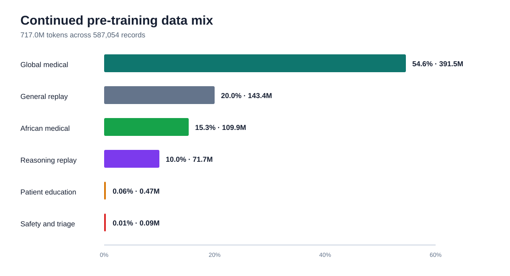
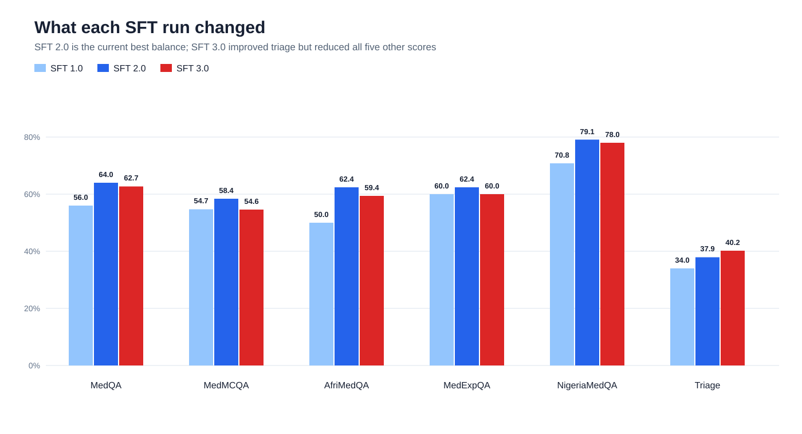
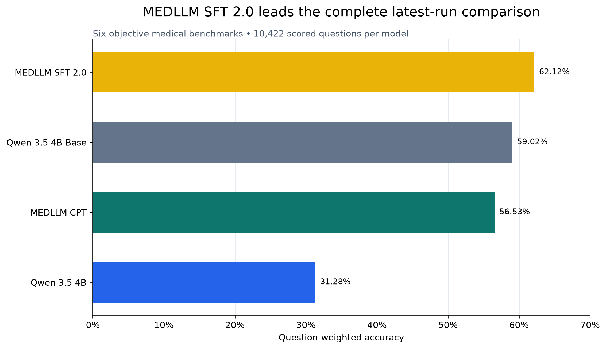
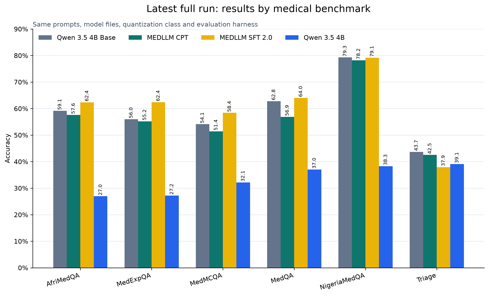

# MEDLLM — Offline Medical Support for African Laptops

**Domain:** Healthcare & Medical 
**Current best checkpoint:** MEDLLM V1 SFT 2.0 (development checkpoint; final public model link pending) 
**Base model:** [Qwen3.5-4B-Base](https://huggingface.co/Qwen/Qwen3.5-4B-Base) 
**Runtime:** `llama.cpp` · GGUF `Q4_K_M` 
**Report status:** Working report, 21 August 2026. One final SFT repair run and the official standard-laptop profile are still pending.

---

## 1. Problem

Many people and health workers in Africa cannot depend on a cloud medical assistant. Internet access can be slow or expensive, patient information is sensitive, and monthly API fees add up. MEDLLM is our attempt to put useful medical question answering, patient education, and basic triage support on an ordinary laptop.

Our target is the [ADTC standard laptop](https://adtc-2026.devpost.com/): 8 GB RAM, integrated graphics, a mid-range x86 CPU, and no internet during use. MEDLLM is an information tool. It is not a doctor and it is not a replacement for emergency services or clinical judgement.

## 2. Why we selected Qwen3.5 4B

We chose the 4B base model for five practical reasons:

1. **It fits the laptop target.** Its `Q4_K_M` GGUF is about 2.7 GB, leaving memory for the context, runtime, and operating system within the strict 7 GB peak-RAM budget.
2. **It gives more quality headroom than a 2B model.** Medical questions need factual recall, careful reading, and instruction following. A 4B model is still small enough for CPU use but gives us more room to train these behaviours.
3. **It is designed for further training.** We used the base checkpoint, not the chat model, so we could first teach it medical language and then teach it how to answer.
4. **It has broad language coverage.** The official model card reports support for 201 languages and dialects. This is useful for future African-language work, although we do not claim strong local-language medical performance yet.
5. **It is practical to release.** It uses the Apache 2.0 licence and works with the required GGUF and `llama.cpp` toolchain.

We also considered Qwen 2B, Llama 3.2 3B, Phi-4-mini, Gemma 4 E2B, and MedGemma 4B. Smaller models offered better speed, while Phi showed promising triage results. However, Qwen 4B gave us the best overall balance of trainability, memory, medical quality, public access, and deployment support. Phi-4-mini is still being checked as a possible teacher for the final triage repair; its current 54% triage result covers only 50 of the 87 questions, so it is not yet a complete comparison.

## 3. Why we selected `Q4_K_M`

`Q4_K_M` stores most model weights in about four bits. This reduces the model from a large training checkpoint to a laptop-sized file while protecting important weights more carefully than simpler four-bit methods.

We selected it because ADTC gives 50% of the score to answer quality, 30% to speed, and 20% to memory efficiency. A larger Q5 or Q8 model may retain slightly more quality, but it leaves less room for the context cache and increases the risk of crossing the RAM limit. A smaller Q2 or Q3 model saves memory but can remove too much medical knowledge. The final profiler run will confirm the actual speed, memory, and temperature on compliant x86 hardware.

## 4. What we trained

We used two different stages:

- **Continued pre-training (CPT):** teach the base model medical language and African medical context from plain text.
- **Supervised fine-tuning (SFT):** teach the model how to answer a user directly, explain briefly, ask for missing information, and follow safety instructions.

### 4.1 Continued pre-training data

The final CPT run used **717,032,988 tokens in 587,054 records**. It contained 501.9 million medical tokens plus general and reasoning replay. Replay was included to reduce the risk that the model would forget useful general skills while learning medicine.

| Data section | Tokens | Share | Main sources |
|---|---:|---:|---|
| Global medical | 391.5M | 54.6% | [PMC Open Access](https://pmc.ncbi.nlm.nih.gov/tools/openftlist/), [Biomed Enriched](https://huggingface.co/datasets/almanach/Biomed-Enriched), [NCBI Bookshelf](https://www.ncbi.nlm.nih.gov/books/) |
| General replay | 143.4M | 20.0% | [FineWeb-Edu](https://huggingface.co/datasets/HuggingFaceFW/fineweb-edu) |
| African medical | 109.9M | 15.3% | Africa-focused PMC articles and selected African guideline text |
| Reasoning replay | 71.7M | 10.0% | [FineMath](https://huggingface.co/datasets/HuggingFaceTB/finemath), [OpenR1 Math](https://huggingface.co/datasets/open-r1/OpenR1-Math-220k), [CodeParrot](https://huggingface.co/datasets/codeparrot/codeparrot-clean) |
| Patient education | 0.47M | 0.06% | [MedlinePlus](https://medlineplus.gov/xml.html) |
| Safety and triage | 0.09M | 0.01% | WHO ETAT/IMCI and ESI material |

The data passed our schema, duplicate, and known-test-overlap checks. No synthetic text was counted in this CPT pack. The mix was not perfect: safety and triage text was far too small, and African medical text was mainly research literature rather than first-contact clinical guidance. This gap later appeared in the triage results.

### 4.2 Continued pre-training setup and result

| Setting | Value |
|---|---|
| Training method | 4-bit adapter training; merged into a 16-bit checkpoint after training |
| Sequence length | 4,096 tokens |
| Adapter | Rank 128, alpha 256 |
| Schedule | One epoch, 73,367 steps, cosine learning-rate schedule |
| Peak learning rate | `2e-5` |
| Hardware | 2 × NVIDIA T4 |
| Selected checkpoint | Step 70,000 |

An early pilot used a learning rate of `2e-4` and became worse. We reduced it to `2e-5`; the full run then stayed stable. Validation loss fell from 1.8084 at step 2,000 to 1.7804 at step 70,000. Patient-education loss improved by 9.45%, African-medical loss by 2.40%, and global-medical loss by 2.13%. Most of the gain arrived before step 50,000, so repeating the same full epoch was not a good use of compute.

The matched external benchmark later showed that CPT alone was not enough: the CPT model scored **56.53%**, compared with **59.02%** for the untouched base. This was an important lesson. Lower training loss does not automatically mean better answers. We kept the medical checkpoint as the starting point for SFT, but moved our effort to answer quality and data balance.

### 4.3 SFT 1.0: useful scale, weak balance

The first SFT dataset had 75,000 rows:

| Source | Rows | Share |
|---|---:|---:|
| ChatDoctor / HealthcareMagic | 31,090 | 41.5% |
| Medical-O1 reasoning data | 14,982 | 20.0% |
| MedMCQA | 11,250 | 15.0% |
| MedQA | 10,178 | 13.6% |
| PubMedQA | 7,500 | 10.0% |

This run taught medical conversation and exam recall, but the mix had clear faults. ChatDoctor dominated the writing style, Medical-O1 included long visible reasoning, and exam data did not teach enough patient-facing safety. The model often spent too many tokens thinking and sometimes failed to reach a direct answer.

### 4.4 SFT 2.0: smaller and more controlled

We rebuilt the data as **30,000 unique rows** with a consistent message format. The split was 27,000 train, 1,500 development, and 1,500 internal test rows. Duplicate questions were removed before the split.

| Data purpose | Rows | Share |
|---|---:|---:|
| Medical knowledge and exam questions | 16,261 | 54.2% |
| Patient education and medication questions | 4,263 | 14.2% |
| DDXPlus diagnostic conversations | 4,500 | 15.0% |
| African medical questions | 3,067 | 10.2% |
| Safety and medical-error correction | 1,441 | 4.8% |
| Short final-answer reasoning examples | 468 | 1.6% |

The main sources were [MedMCQA](https://huggingface.co/datasets/openlifescienceai/medmcqa), [MedQA](https://huggingface.co/datasets/bigbio/med_qa), [PubMedQA](https://huggingface.co/datasets/qiaojin/PubMedQA), [AfriMedQA](https://huggingface.co/datasets/afrimedqa/afrimedqa_v2), [AfriHealth-QA](https://huggingface.co/datasets/ImhotepSystems/AfriHealth-QA), [DDXPlus](https://github.com/mila-iqia/ddxplus), [MedQuAD](https://github.com/abachaa/MedQuAD), [MEDEC](https://github.com/abachaa/MEDEC), [MedicationQA](https://github.com/abachaa/Medication_QA_MedInfo2019), MedlinePlus, and [MedSafety](https://github.com/AI4LIFE-GROUP/med-safety-bench).

We made direct answers the default: 22,500 direct replies, 3,000 answers with a short reason, and 4,500 short clarification dialogues. Visible long-form reasoning was removed.

### 4.5 SFT 3.0: a useful failed experiment

SFT 3.0 used 37,000 rows: 29,500 replay rows and 7,500 new triage candidates. Triage increased from **37.9% to 40.2%**, but all five other benchmark scores fell. We therefore rejected SFT 3.0 as the final checkpoint and returned to SFT 2.0.

The main problem was not the number of triage rows. Many generated cases used diagnosis severity as a shortcut for urgency, several triage systems were mapped too loosely, and the templates lacked enough clear Yellow, Green, and Black boundary cases. Our final repair run will start from SFT 2.0 and use balanced, rule-checked triage examples with general medical replay.

## 5. Benchmarks

Our main matched comparison contains **10,422 scored questions per model**. Every model received the same prompts, quantization class, random seed, parser, and `llama.cpp` evaluation code.

| Benchmark | Questions | What it checks |
|---|---:|---|
| MedQA | 1,273 | Medical licensing knowledge and clinical reasoning |
| MedMCQA | 4,183 | Broad medical-subject knowledge |
| MedExpQA | 125 | Transfer to medical questions that require explanation |
| AfriMedQA | 3,910 | Medical knowledge in African settings |
| NigeriaMedQA | 844 scored | Nigerian medical knowledge |
| Triage | 87 | Red, Yellow, Green, and Black urgency classification |

We also used medical MMLU, ARC-Easy, and small patient-safety prompt sets as development checks. We do not use those smaller checks as the main improvement claim. The 87-question triage set is especially small and measures mass-casualty classification; it is not a complete clinical-safety test.

## 6. Current result

SFT 2.0 reached **62.12% question-weighted accuracy**. This is **3.10 percentage points above the Qwen3.5 4B Base** and **5.58 points above MEDLLM CPT** in the same complete run.

SFT 2.0 improved MedQA, MedMCQA, MedExpQA, and AfriMedQA. NigeriaMedQA stayed almost unchanged. Triage became worse than the base model. This is why we are keeping SFT 2.0 as the base for one narrow repair run instead of continuing from SFT 3.0.

## 7. What we learned

- More data is not automatically better data.
- Continued pre-training improved its own validation loss but did not improve the matched external score by itself.
- A smaller, cleaner SFT dataset produced our strongest overall result.
- Long visible reasoning made short medical answers worse and slower.
- Diagnostic conversations do not automatically teach urgency classification.
- A system prompt can guide the model, but safety and triage behaviour must also be learned in the model weights because the judges supply their own prompts.
- We must report sample counts. Phi-4-mini's current 54% triage number covers 50 questions, while the MEDLLM scores above cover all 87.

## 8. Work still in progress

Before final submission we will:

1. Run one focused SFT repair from SFT 2.0 with balanced triage boundaries and replay data.
2. Keep protected benchmark questions out of training.
3. Run the full matched benchmark once on the selected checkpoint.
4. Run the official ADTC profiler on a compliant 8 GB x86 Ubuntu laptop.
5. Replace this draft's pending speed, peak-RAM, and thermal fields with measured values.
6. Publish the final GGUF at a credential-free URL and update `metadata.json` and `download_model.sh`.

## 9. Current deployment status

| Item | Current status |
|---|---|
| GGUF format | Working |
| Quantization | `Q4_K_M` |
| Approximate model file | 2.7 GB |
| Offline `llama.cpp` inference | Working |
| Final SFT checkpoint | Pending one repair run |
| Standard-laptop peak RAM | Pending official profiler |
| Standard-laptop generation speed | Pending official profiler |
| Standard-laptop thermal result | Pending official profiler |

All benchmark results in this report are development results. They are not clinical certification and they are not the organizer's final hidden score.
